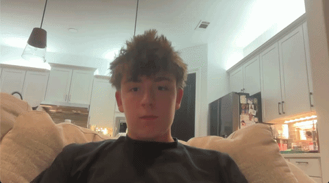

# Hand Gesture Recognition

Real-time hand gesture classification from a webcam. MediaPipe extracts 21 hand landmarks per frame, and a small PyTorch network classifies the hand shape into one of five gestures: fist, palm, peace, point, thumbs up.



## How it works

1. **Landmark extraction.** MediaPipe's Hand Landmarker finds 21 (x, y, z) points on the hand in every frame.
2. **Normalization.** Landmarks are re-centered on the wrist and scaled by hand size, so the model learns hand *shape* and ignores where the hand is on screen or how far away it is.
3. **Classification.** The 63 normalized values feed a fully-connected network (63 → 128 → 64 → 5) trained with cross-entropy loss on ~2,600 samples I collected myself.

Working from landmarks instead of raw pixels means the classifier is tiny, trains in seconds on a laptop, and runs in real time on CPU.

## Setup

```bash
git clone https://github.com/jonathon-lockridge/hand-gesture-recognition.git
cd hand-gesture-recognition
python3.12 -m venv .venv
source .venv/bin/activate
pip install -r requirements.txt
```

MediaPipe is pinned to 0.10.35. Version 1.0.1 crashes on macOS Apple Silicon at graph startup ([issue #6356](https://github.com/google-ai-edge/mediapipe/issues/6356)).

## Usage

```bash
python predict.py                    # live prediction with the included model
python collect_data.py <gesture>     # record new samples (SPACE to record, Q to quit)
python train.py                      # retrain on data/gestures.csv
```

## Results

Held-out test accuracy is ~100%, but that number is inflated: test frames come from the same recording sessions as training frames, so neighboring frames are near-duplicates. Live performance is the real test.

Live, all five gestures classify reliably at normal angles. The main failure case was pointing directly at the camera, where the index finger foreshortens and the landmarks resemble a fist. Recording ~200 additional point samples at those angles fixed it. Extreme tilts can still misclassify briefly.

## Project structure

```
hand_utils.py      MediaPipe setup, landmark normalization, skeleton drawing
collect_data.py    webcam data collection → data/gestures.csv
model.py           GestureNet architecture
train.py           training + evaluation → models/gesture_model.pt
predict.py         live webcam inference
```

## Next steps

- Gesture-controlled drawing: point to draw, fist to clear, palm to change color
- More gestures and two-hand support
- Temporal smoothing to stop single-frame flickers